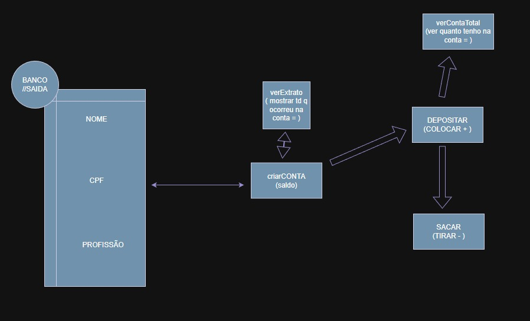

<h1 align="center">Welcome to my Repositories 🤝</h1>
<p>
  
</p>

> ✍️ - I developed some exercises and control of bank accounts in Csharp to practice.
<br>
> Diagram :
  

## Download

```sh
https://github.com/eucesar/Csharp-Practicing.git
```

## Cesar

👤 **Cesar Iglesias**

* Github: [@eucesar](https://github.com/eucesar)
* LinkedIn: [@Cesar Iglesias](https://www.linkedin.com/in/cesar-iglesias-tecnologia/)

***
